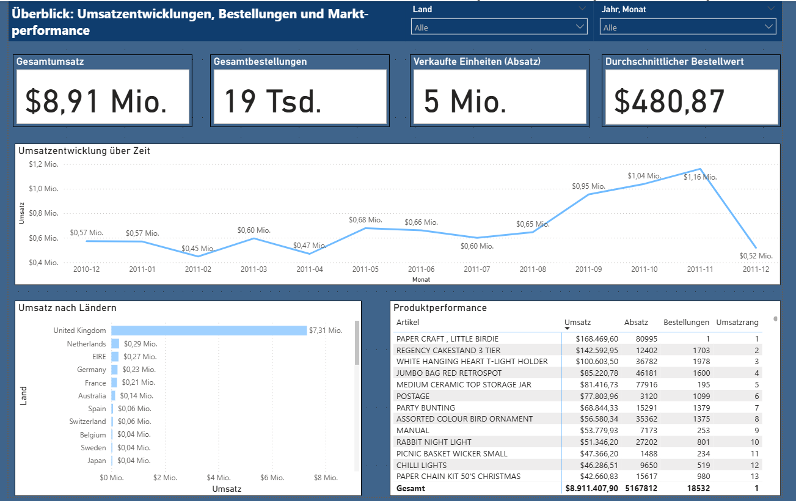
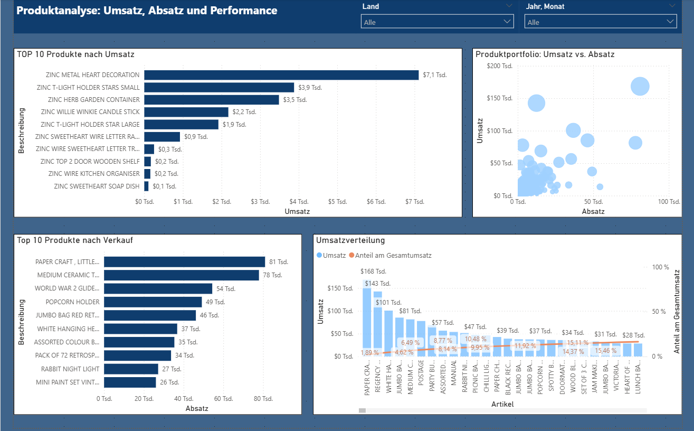
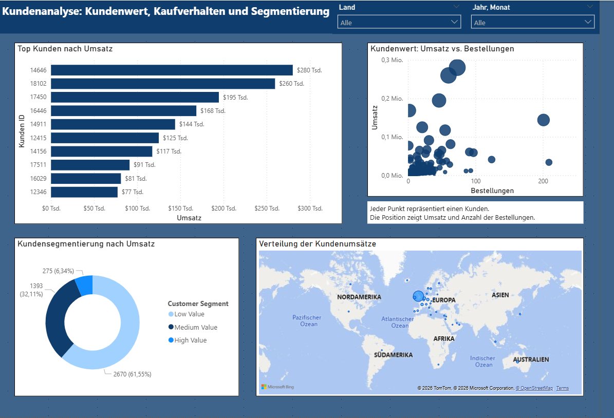

## **Project Overview: Retail Analytics Pipeline**

This project builds an end-to-end data pipeline using Python and Azure SQL to analyze retail sales data.

The pipeline follows a medallion architecture (Bronze → Silver → Gold) and loads the final data model
into Azure SQL for reporting in Power BI.

## **Architecture**

- **Bronze**: Raw data (original dataset)
- **Silver**: Cleaned and transformed data
- **Gold**: Star schema (fact + dimension tables)
- **Azure SQL**: Final data warehouse layer
- **Power BI**: Dashboard and analysis

## **Data Pipeline**

The project implements a full end-to-end analytics workflow:

Raw Data (CSV)  
→ Python ETL Pipeline (Cleaning & Transformation)  
→ Medallion Architecture (Bronze → Silver → Gold)  
→ Azure SQL Data Warehouse  
→ Power BI Dashboard

## Data Cleaning
- Removed returns (negative quantities)
- Removed invalid prices (≤ 0)
- Removed missing product descriptions
- Removed missing customer IDs

## **Data Pipeline**

The project implements a full end-to-end analytics workflow:

Raw Data (CSV)  
→ Python ETL Pipeline (Cleaning & Transformation)  
→ Medallion Architecture (Bronze → Silver → Gold)  
→ Azure SQL Data Warehouse  
→ Power BI Dashboard

## **Data Model**

The project uses a star schema consisting of one fact table and three dimension tables.

Fact table:
- fact_sales

Dimension tables:
- dim_customer
- dim_product
- dim_date

## **Tech Stack** 

- Python (pandas, SQLAlchemy)
- Azure SQ Database
- Power BI
- Parquet (data storage)

## **Project Structure**

```
project/
│
├── data/
│   ├── bronze/
│   ├── silver/
│   └── gold/
│
├── notebooks/
│   ├── 01_data_pipeline.ipynb
│   ├── 02_analytics.ipynb
│   └── 03_load_to_azure.ipynb
│
├── scripts/
│   ├── data_pipeline.py
│   └── load_to_azure_sql.py
│
├── sql/
│   └── create_tables.sql
│
├── powerbi/
│   └── retail_dashboard.pbix
│
├── images/
│   ├── overview.png
│   ├── product_analysis.png
│   └── customer_analysis.png
│
├── requirements.txt
└── README.md
```

## **Data Model**

The project uses a star schema consisting of one fact table and three dimension tables.

Fact table:
- fact_sales

Dimension tables:
- dim_customer
- dim_product
- dim_date

## **Tech Stack** 

- Python (pandas, SQLAlchemy)
- Azure SQL Database
- Power BI
- parquet (data storage)

## **Project Structure**

```
project/
│
├── data/
│   ├── bronze/
│   ├── silver/
│   └── gold/
│
├── notebooks/
│   ├── 01_data_pipeline.ipynb
│   ├── 02_analytics.ipynb
│   └── 03_load_to_azure.ipynb
│
├── scripts/
│   ├── data_pipeline.py
│   └── load_to_azure_sql.py
│
├── sql/
│   └── create_tables.sql
│
├── powerbi/
│   └── retail_dashboard.pbix
│
├── images/
│   ├── overview.png
│   ├── product_analysis.png
│   └── customer_analysis.png
│
├── requirements.txt
└── README.md
```

## **Dashboard pages**

Page 1: Overview

Page 2: Product Analysis

Page 3: Customer Analysis

**Dashboard Preview**





## **Key Insights**
- Revenue is highly concentrated among a small number of products (Pareto principle).
- A small number of customers generate significantly higher revenue than the majority.
- A small number of customers generate significantly higher revenue than the majority.

